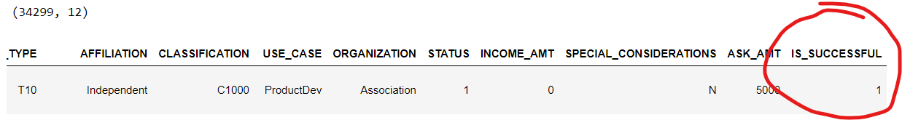
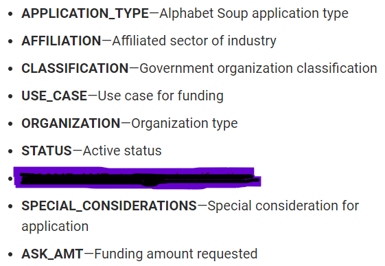
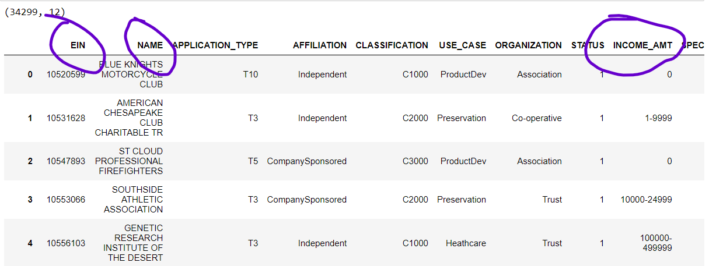
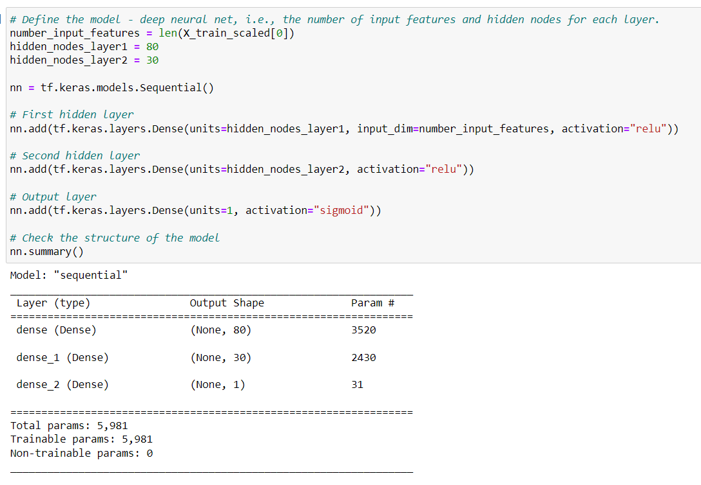
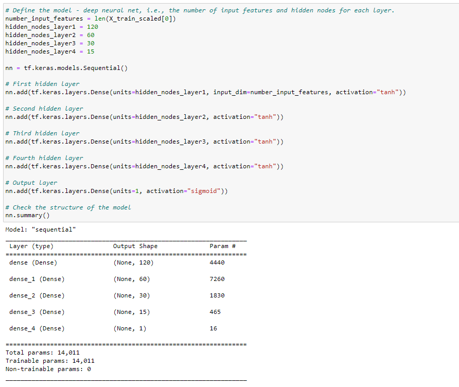
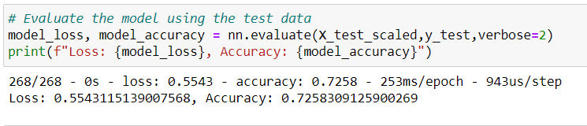
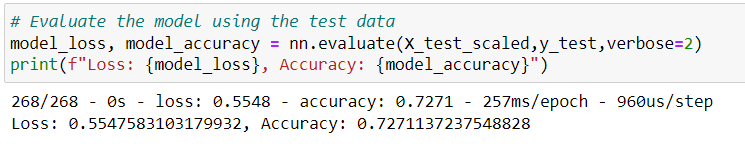
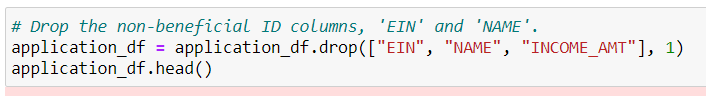
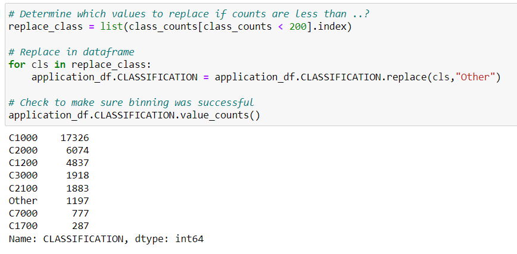

# Neural Network Charity Analysis

## Overview of the analysis

The purpose of this project is to use the features in the provided dataset to help Beks create a binary classifier that is capable of predicting whether applicants will be successful if funded by Alphabet Soup.

This new assignment consists of three technical analysis deliverables and a written report as follows:

**I** Preprocessing Data for a Neural Network Model

**II** Compile, Train, and Evaluate the Model

**III** Optimize the Model

**IV** A Written Report on the Neural Network Model

## Results

### A. Data Preprocessing

`1` What variable(s) are considered the target(s) for your model?

The variable considered the target is IS_SUCCESSFUL, which identifies if each organization had used the money affectively

`2` What variable(s) are considered to be the features for your model?
I considered to be features (i) APPLICATION_TYPE; (ii) AFFILIATION; (iii) CLASSIFICATION; (iv) USE_CASE; (v) ORGANIZATION; (vi) STATUS; (vii) SPECIAL_CONSIDERATIONS; and (viii) ASK_AMT, because each of them contains important information to be consider at the time to select them to found.

`3` What variable(s) are neither targets nor features, and should be removed from the input data?

EIN, NAME and INCOME_AMT were neither targets nor features because they do not contain representative information to consider at the time of assigning founds. 

### B. Compiling, Training, and Evaluating the Model

`1` How many neurons, layers, and activation functions did you select for your neural network model, and why?

In the first model, I choose 80 neurons for the first layer and 30 for the second, and I used for the input the `relu` function because it is ideal for looking at positive nonlinear input data for classification or regression, and for the output the `sigmoid` function because it is ideal for binary classification.

In the optimized model, I choose 120 neurons for the first layer, 60 for the second, 30 for the third, and 15 for the fourth, and I used for the input the `tanh ` function because it expands the range between -1 and 1, and for the output the `sigmoid` function.

`2` Were you able to achieve the target model performance?

In the first model, I achieved the target model performance.

In the optimized model, I was able to achieve the target model performance with a slight increase but still under 75%. 

`3` What steps did you take to try and increase model performance?

First, I removed INCOME_AMT from the features:

Second, I created more bins for rare occurrences in columns:

Third, I choose 120 neurons for the first layer, 60 for the second, 30 for the third, and 15 for the fourth, and I used for the input the `tanh ` function because it expands the range between -1 and 1, and for the output the `sigmoid` function, and 

Finally, I increased the number of epochs to the training regimen.

## Summary

As mentioned before, in the first model, I got a loss of 0.5543 and an accuracy of 0.7258

In the optimized model, I got a loss of 0.5548 and an accuracy of 0.7271, which were slightly higher than in the first model.

In my opinion, for this case could be better to use a Random Model Forest, for the following reasons:

1. We were evaluating tabular data not images or natural language, so the RMF can handle perfectly instead of the neural network.

2. RFM with enough estimators and tree depth should be able to perform at a similar capacity to most deep learning models.

3. RFM can train on a large dataset and predict values in seconds, while the deep learning model required a couple of minutes to train on the tens of thousands of data points

